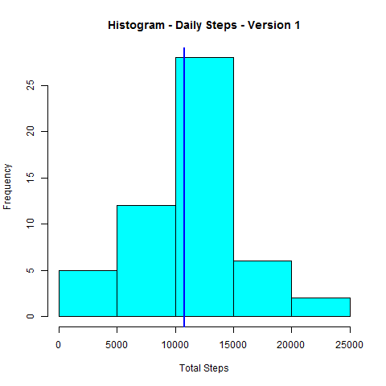

## Loading and preprocessing the data
0. Load all required libraries
```{r}
library(proto,quietly=TRUE)
library(DBI,quietly=TRUE)
library(tcltk,quietly=TRUE)
library(sqldf,quietly=TRUE)
library(lubridate,quietly=TRUE)
library(stringr,quietly=TRUE)
library(lattice,quietly=TRUE)
```

1. Data is already in the repository in compressed file

2. Unzip data

3. Load activity file a data frame

```{r}
datazipfile <- "activity.zip"
unzip(datazipfile)
activityfile <- "activity.csv"
activityDF <- read.csv(activityfile)
```

4. Processing - converting text field to a date

```{r}
processedDF <- activityDF
processedDF$date <- ymd(processedDF$date)
#the intervals go from 5 to 2355, i.e.
#from 00:05 to 23:55
```

## What is mean total number of steps taken per day?

_1. Calculate the total number of steps taken per day_
- The processed set is copied for use in a future step
- NA rows are removed from the processed set

```{r}
#Remove NAs
#make a copy first for further use
processedDF1 <- processedDF
processedDF <- processedDF[complete.cases(processedDF),]
```

```{r}
## calculate the total steps per day
calculatedDF1 <- sqldf("select date, sum(steps) AS TotalSteps 
                         from processedDF group by date")
```

#### Barplot versus Histogram
a Barplot will show the 53 days in the horizontal axis with the number of steps
in the vertical axis, and each data point will show as a bar
a [histogram](http://en.wikipedia.org/wiki/Histogram)
A histogram is a graphical representation of the distribution of data. 
It is an estimate of the probability distribution of a continuous variable 
(quantitative variable) and was first introduced by Karl Pearson.

2. Histogram of the total number of steps taken each day
```{r}
png("./figure/plot1.png",width=480,height=480,units="px")
hist(calculatedDF1$TotalSteps,
     main="Histogram - Daily Steps - Version 1",
     xlab="Total Steps",
     col=5)
dev.off()
```



_3. Calculate and report the mean and median of the total number of steps taken per day_
```{r}
stepsmean <- format(round(mean(calculatedDF1$TotalSteps),2), nsmall=2)                         
stepsmedian <- format(round(median(calculatedDF1$TotalSteps),2), nsmall=2)
#the printing of r parameters in sentences in R Markdown works in RStudio but it does not in GitHub, showing then the results here
cat(paste("Mean total number of steps is",stepsmean))
cat(paste("Median total number of steps is",stepsmedian))
```
## What is the average daily activity pattern?

_1. Make a time series plot (i.e. type = "l") of the 5-minute interval (x-axis) and the average number of steps taken, averaged across all days (y-axis)_

```{r}
#get the average of all steps in a column and the step in another
calculatedDF2 <- sqldf("select interval, avg(steps) AS meanstep 
                         from processedDF group by interval")

#plot it
png("./figure/plot2.png",width=480,height=480,units="px")
plot(calculatedDF2,type="l",
     lwd=3,
     main="Average steps per interval",
     xlab="Interval",
     ylab="Average number of steps",
     col=4)
dev.off()
```


_2. Which 5-minute interval, on average across all the days in the dataset, contains the maximum number of steps?_

```{r}
#Find the corresponding interval to which the mean number of steps is the
#maximum
maxinterval <- calculatedDF2[calculatedDF2$meanstep
                             ==max(calculatedDF2$meanstep),1]
maxinterval <- str_pad(maxinterval,4,pad="0")
maxinterval <- paste(substr(maxinterval,1,2),":",
        substr(maxinterval,3,4),sep="")
#the printing of r parameters in sentences in R Markdown works in RStudio but it does not in GitHub, showing then the results here
cat(paste("The 5 minute interval with the average maximum number of steps is"
          ,maxinterval))
```

## Imputing missing values
_1. Calculate and report the total number of missing values in the dataset (i.e. the total number of rows with NAs)_
```{r}
#By inspection, we see that the NAs appear only in the column "steps"
NAtotal <- sum(is.na(processedDF1))
#the printing of r parameters in sentences in R Markdown works in RStudio but it does not in GitHub, showing then the results here
cat(paste("The total number of missing values in the dataset is"
          ,NAtotal))
```

_2. Devise a strategy for filling in all of the missing values in the dataset. The strategy does not need to be sophisticated. For example, you could use the mean/median for that day, or the mean for that 5-minute interval, etc._

##### The strategy is to replace with the mean value for the specific interval calculated with the complete.cases initial data set and stored in calculatedDF2

_3. Create a new dataset that is equal to the original dataset but with the missing data filled in._

```{r}
for (i in 1:nrow(processedDF1)) {
        if (is.na(processedDF1$steps[i])) {
                processedDF1$steps[i] <-
                        calculatedDF2$meanstep[calculatedDF2$interval==
                                                       processedDF1$interval[i]]
        }
}
```

_4. Make a histogram of the total number of steps taken each day and Calculate and report the mean and median total number of steps taken per day. Do these values differ from the estimates from the first part of the assignment? What is the impact of imputing missing data on the estimates of the total daily number of steps?_

```{r}
## calculate the total steps per day
calculatedDF3 <- sqldf("select date, sum(steps) AS TotalSteps 
                         from processedDF1 group by date")
png("./figure/plot3.png",width=480,height=480,units="px")
hist(calculatedDF3$TotalSteps,
     main="Histogram - Daily Steps - Version 2",
     xlab="Total Steps",
     col=6)
dev.off()

#the printing of r parameters in sentences in R Markdown works in RStudio but it does not in GitHub, showing then the results here

stepsmean1 <- format(round(mean(calculatedDF3$TotalSteps),2), nsmall=2)
cat(paste("The mean of the total number of steps taken per day is"
          ,stepsmean1))

stepsmedian1 <- format(round(median(calculatedDF3$TotalSteps),2), nsmall=2)
cat(paste("The median of the total number of steps taken per day is"
          ,stepsmedian1))

if(stepsmean==stepsmean1) {
        meancomparison <- "the same value"
} else {
        meancomparison <- "different values"
}
cat(paste("When comparing this mean value with the first part of the assesment they have",meancomparison))
if(stepsmedian==stepsmedian1) {
        mediancomparison <- "the same value"
} else {
        mediancomparison <- "different values"
}
cat(paste("When comparing this median value with the first part of the assesment they have",mediancomparison))
```


## Are there differences in activity patterns between weekdays and weekends?

_1. Create a new factor variable in the dataset with two levels - "weekday" and "weekend" indicating whether a given date is a weekday or weekend day._

This [stack overflow link]("http://stackoverflow.com/questions/16570302/how-to-add-a-factor-column-to-dataframe-based-on-a-conditional-statement-from-an") helped to implement this solution

```{r}
processedDF1$fv <- as.factor(ifelse(
        weekdays(processedDF1$date)=="Saturday",
        "weekend", 
        ifelse(weekdays(processedDF1$date)=="Sunday",
               "weekend","weekday")
        ))
```

_2. Make a panel plot containing a time series plot (i.e. type = "l") of the 5-minute interval (x-axis) and the average number of steps taken, averaged across all weekday days or weekend days (y-axis)._ 

```{r}
#get the average of all steps in a column and the interval and factor in another
calculatedDF4 <- sqldf("select interval, fv, avg(steps) AS meanstep 
                         from processedDF1 group by interval, fv")

png("./figure/plot4.png",width=480,height=480,units="px")
xyplot(meanstep ~ interval | fv, 
       data = calculatedDF4, layout = c(1,2),
       type="l",ylab="number of steps",
       main="Comparison steps weekdays and weekends")
dev.off()
```


####Looking at the panel, it shows that during weekdays there is an early spike in steps, while in the weekends there is a more even distribution after the morning spike